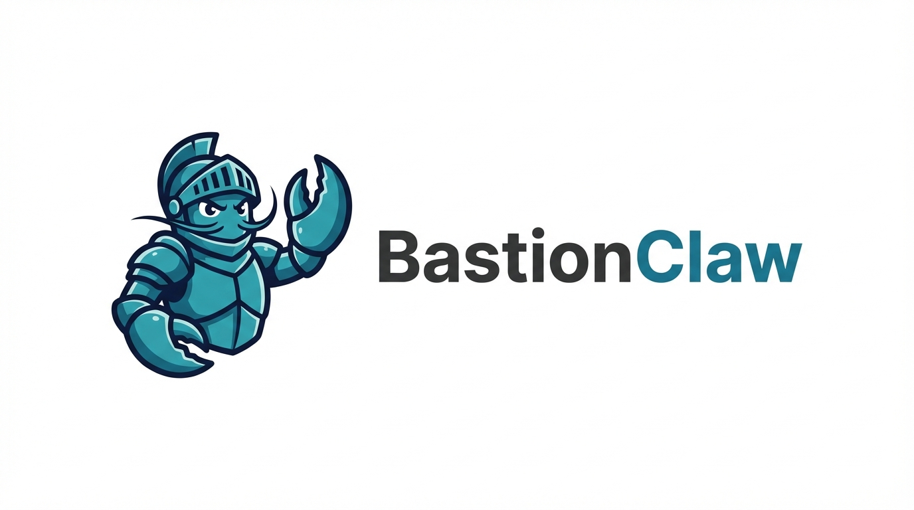
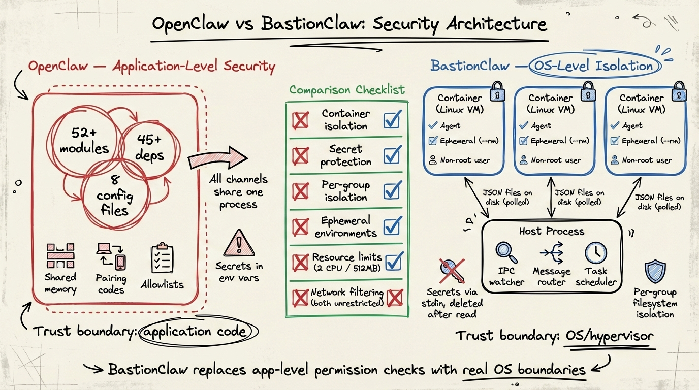
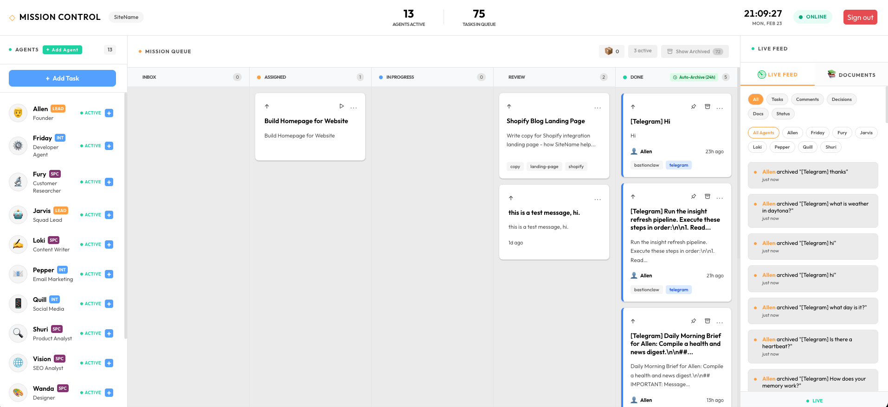
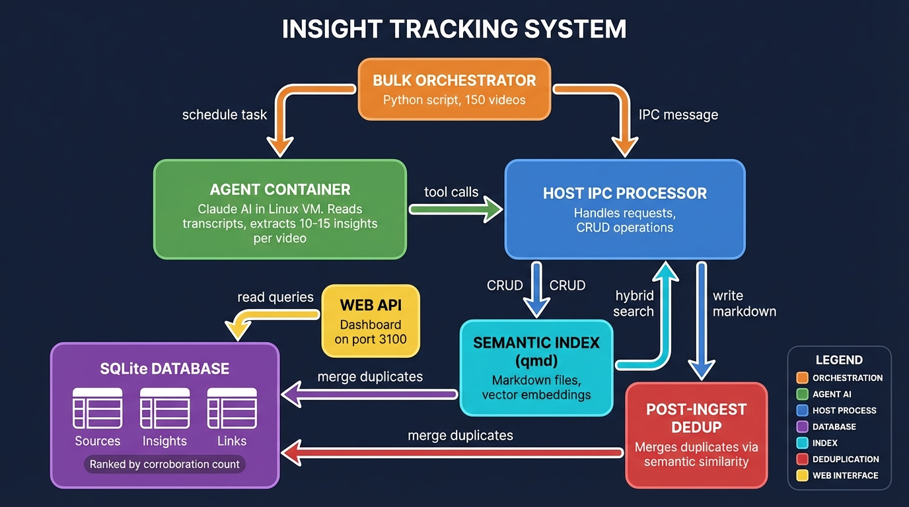
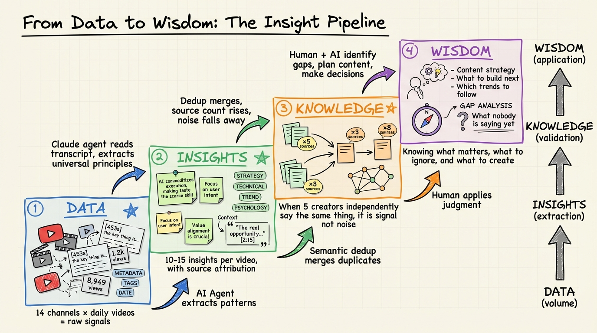

<p align="center">
  
</p>

<p align="center">
  A personal Claude assistant that runs securely in containers. Forked from <a href="https://github.com/qwibitai/nanoclaw">NanoClaw</a> with Telegram as the default channel, a built-in web control panel, and cybersecurity-focused customizations. Formerly known as NanoClaw Hard Shell.
</p>

## About This Fork

**Support**
For more support and information about this repo, join the free mentoring of [Dr. Allen Harper](https://allenharper.com).  Once inside, see the Secure Vibe Coding Masterclass, where we are engaged in discussions on this and other similar topics.

**BastionClaw** (formerly NanoClaw Hard Shell) is a fork of [NanoClaw](https://github.com/qwibitai/nanoclaw), an awesome lightweight personal Claude assistant. This fork makes the following changes:

- **Telegram by default** — Uses Telegram Bot API (via Grammy) instead of WhatsApp as the primary channel
- **Multi-channel support** — Discord (via discord.js) and WhatsApp alongside Telegram. Run any combination simultaneously.
- **Agent Swarm identities** — On Discord, each subagent gets its own username and avatar via webhooks. On Telegram, each gets its own bot identity in the group.
- **WhatsApp sender allowlist** — Restricts which phone numbers can trigger the bot on WhatsApp, preventing unauthorized users in shared groups from activating the agent under your identity
- **Web control panel** — Built-in Fastify + Lit web UI for monitoring, chat, and management
- **Cybersecurity hardening** — Additional tooling and configuration for security research workflows

All credit for the core architecture, container isolation model, skills system, and agent swarm support goes to the [upstream NanoClaw project](https://github.com/qwibitai/nanoclaw).

## Why NanoClaw Exists

The authors of [NanoClaw](https://github.com/qwibitai/nanoclaw) built it as a lightweight, secure alternative to [OpenClaw](https://github.com/openclaw/openclaw). OpenClaw has 52+ modules, 8 config management files, 45+ dependencies, and abstractions for 15 channel providers. Security is application-level (allowlists, pairing codes) rather than OS isolation. Everything runs in one Node process with shared memory.

NanoClaw gives you the same core functionality in a codebase you can understand in 8 minutes. One process. A handful of files. Agents run in actual Linux containers with filesystem isolation, not behind permission checks.

BastionClaw builds on this and takes it further.

<p align="center">
  
</p>

## Why I Forked It

I needed a personal Claude assistant tailored for cybersecurity work. NanoClaw's container isolation model and small codebase made it the ideal foundation. This fork adds:

- **Telegram-first setup** — Official bot API is more reliable than WhatsApp's unofficial library, and better suited for automated workflows
- **Web control panel** — Full browser-based UI for monitoring agent sessions, managing tasks, viewing logs, querying the qmd semantic memory system, and chatting directly with the agent without needing a phone
- **WhatsApp sender allowlist** — Unlike Telegram (where only your bot receives messages), WhatsApp links as your personal account — anyone in your groups who types the trigger word activates the agent as you. `WHATSAPP_ALLOWED_SENDERS` restricts which phone numbers can trigger the bot while still storing all messages as conversation context
- **Security cherry-picks** — Backported upstream security PRs (CPU/memory limits, secret sanitization, per-group IPC namespaces, mount allowlist) to harden the fork for sensitive workflows like penetration testing and threat analysis
- **Semantic memory + insight engine** — Long-term memory powered by hybrid search (BM25 + vector embeddings) running fully local with GGUF models. Optional Data-to-Wisdom pipeline ingests YouTube videos, articles, and PDFs, extracts generalizable insights, deduplicates semantically across sources, and surfaces corroborated patterns
- **Windows + Docker support** — Full WSL2 setup guide with Docker/Podman as container runtime alternatives to Apple Container

The upstream project's philosophy of "skills over features" means these customizations stay clean and maintainable.

## Sister Project: Mission Control

<p align="center">
  <a href="https://github.com/harperaa/bastionclaw-mission-control">
    
  </a>
</p>

[**BastionClaw Mission Control**](https://github.com/harperaa/bastionclaw-mission-control) — A real-time command center for managing autonomous agents and task queues. Built with Convex, React, and Tailwind CSS, it provides a kanban-style mission queue, live agent roster with status indicators, document preview with full markdown rendering, and per-agent configuration with custom system prompts and personas. Integrates with BastionClaw for automatic task tracking with real-time lifecycle events.

## Quick Start

### macOS / Linux

```bash
git clone https://github.com/harperaa/bastionclaw.git
cd bastionclaw
claude
```

Then run `/setup`. Claude Code handles everything: dependencies, Telegram bot creation, container setup, service configuration.

### Windows

Windows requires WSL2 (Windows Subsystem for Linux), which provides a real Linux environment. Everything runs inside WSL2.

#### Step 1: Install WSL2

Open **PowerShell as Administrator** (right-click Start > "Terminal (Admin)" or search "PowerShell" > Run as Administrator) and run:

```powershell
wsl --install
```

This installs WSL2 with Ubuntu. **Restart your computer** when prompted.

After restarting, Ubuntu will open automatically. Create a Linux username and password when asked (these are separate from your Windows login).

#### Step 2: Install Docker

Download and install [Docker Desktop for Windows](https://www.docker.com/products/docker-desktop/). During installation, make sure **"Use WSL 2 instead of Hyper-V"** is checked.

After installing, open Docker Desktop, go to **Settings > Resources > WSL Integration**, enable your Ubuntu distribution, and click **Apply & Restart**.

#### Step 3: Install Node.js and Claude Code

Open your Ubuntu terminal (search "Ubuntu" in Start menu) and run:

```bash
# Install Node.js 22
curl -fsSL https://deb.nodesource.com/setup_22.x | sudo -E bash -
sudo apt install -y nodejs

# Install Claude Code
npm install -g @anthropic-ai/claude-code
```

#### Step 4: Clone and Set Up

**Important:** Clone inside your Ubuntu home directory, not on the Windows filesystem (`/mnt/c/`). The Windows filesystem is much slower through WSL2.

```bash
cd ~
git clone https://github.com/harperaa/bastionclaw.git
cd bastionclaw
claude
```

Then run `/setup-windows`. Claude Code validates your WSL2 environment, installs dependencies, configures Docker or Podman, and runs 5 validation batteries. After that, run `/setup` to configure Telegram and your assistant.

#### Keeping It Running

WSL2 shuts down when you close all terminal windows. To keep BastionClaw running:

- **Option A:** Keep a terminal window open
- **Option B:** After setup completes, the systemd service keeps it running as long as WSL2 is active. To prevent WSL2 from shutting down, create a Windows scheduled task that runs `wsl -d Ubuntu -e sleep infinity` at login

## What It Supports

- **Multi-channel messaging** — Telegram (default), Discord (`/add-discord`), or WhatsApp (`/add-whatsapp`). Run one or all simultaneously.
- **Isolated group context** — Each group has its own `CLAUDE.md` memory, isolated filesystem, and runs in its own container sandbox with only that filesystem mounted
- **Main channel** — Your private channel (DM with bot) for admin control; every other group is completely isolated
- **Scheduled tasks** — Recurring jobs that run the agent and can message you back
- **Web access** — Search and fetch content
- **Container isolation** — Agents sandboxed in Apple Container (macOS) or Docker (macOS/Linux/Windows WSL2)
- **Agent Swarms** — Spin up teams of specialized agents that collaborate on complex tasks. Multiple swarms can run on different channels simultaneously, each with its own team composition and isolated group folder. See [Agent Swarms](#agent-swarms) below for details.
- **Optional integrations** — Add Gmail (`/add-gmail`), voice transcription (`/add-voice-transcription`), and more via skills
- **Semantic memory** — Long-term memory powered by [qmd](https://github.com/tobi/qmd) with hybrid search (BM25 + vector + LLM reranking). Conversations are progressively indexed mid-session and archived at compaction. The agent naturally recalls past discussions without being asked. Runs fully local with GGUF models (~2GB) — no cloud APIs needed. See [docs/MEMORY.md](docs/MEMORY.md) for architecture details.
- **Insight engine** (optional) — Ingest articles, YouTube videos, PDFs, and podcasts to extract generalizable insights. The system deduplicates semantically — when multiple independent sources express the same idea, they merge and the insight's corroboration count rises. Top insights surface the most widely-observed principles across all your content. See [docs/INSIGHTS.md](docs/INSIGHTS.md) for architecture details.

<p align="center">
  
</p>

- **Web control panel** — Browser-based UI for monitoring, chat, and management

## Web Interface

BastionClaw includes a built-in web control panel that starts automatically alongside the main process at `http://localhost:3100`.

### Tabs

| Group | Tabs | Purpose |
|-------|------|---------|
| **Chat** | Chat | Send messages to your agent directly from the browser. Spawns a container and streams the response in real-time via WebSocket. |
| **Dashboard** | Overview, Channels, Memory | System stats (uptime, queue depth, message counts), channel health status, and semantic memory index with collection browser and search. |
| **Operations** | Insights, YouTube, Groups, Messages, Tasks, Sessions | Insights ranked by corroboration (optional), YouTube source dashboard with VPH tracking (optional), registered groups, message history, scheduled tasks (pause/resume/delete), and active sessions. |
| **System** | Skills, Config, Logs, Debug | Full CRUD for skills, CLAUDE.md editor with per-group scope selector, in-memory log viewer with level filters, and system diagnostics (queue state, DB stats, process info). |

### How it works

The web server runs inside the same Node.js process as everything else — no separate service to manage. It uses Fastify for HTTP/WebSocket and serves a pre-built Lit frontend from `ui/dist/`.

- **REST API** (`/api/*`) for reads and mutations — calls `db.ts` functions directly
- **WebSocket** (`/ws`) for live events and chat streaming
- **Chat** sends messages through the same `GroupQueue` and `runContainerAgent` pipeline as Telegram messages, using a `web@chat` pseudo-JID

To rebuild the frontend after changes:

```bash
cd ui && npm install && npm run build
```

The port can be changed with the `WEBUI_PORT` environment variable (default: `3100`).

## Data to Wisdom Pipeline

[](https://youtu.be/ZbeXp3EVd8U)

Optionally, BastionClaw turns raw content into actionable knowledge through a four-stage pipeline:

1. **Data** — Monitor YouTube channels, ingest articles, PDFs, and podcasts. The system pulls transcripts and metadata automatically.
2. **Insights** — An AI agent extracts 10-15 generalizable principles per source, each with category, context quote, and timestamp attribution.
3. **Knowledge** — Semantic deduplication merges insights across sources. When 5 creators independently say the same thing, it's signal — not noise. Corroboration count drives ranking.
4. **Wisdom** — Gap analysis identifies what nobody is saying yet. Human + AI review the corroborated insights to plan content strategy, identify trends, and make decisions.

<p align="center">
  
</p>

To enable the pipeline, run `/ingest` to add individual sources or `/refresh-insights` to set up YouTube channel monitoring with scheduled tasks that automatically fetch new videos and extract insights on a recurring basis.

## Agent Swarms

Agent Swarms let you create teams of specialized agents that collaborate on tasks. Each agent gets its own visible identity in the chat — distinct usernames and avatars on Discord, separate bot identities on Telegram — so users can see who's doing what.

### How it works

When a user sends a task, the lead agent breaks it into subtasks and delegates to specialists (Researcher, Developer, Reviewer, etc.) using Claude's agent teams. Each specialist posts their work to the group chat via `send_message` with a `sender` parameter that identifies them. The host routes each message through the appropriate channel identity:

- **Discord**: Per-channel webhooks. Each `sender` name becomes a unique username + auto-generated avatar.
- **Telegram**: Bot pool. Each `sender` is assigned a dedicated bot from a pool of 3-5 bots you create via BotFather.

### Multi-swarm support

You can run multiple swarms on different channels simultaneously. Each swarm has:

- **Its own Discord channel or Telegram group** with a dedicated webhook/bot pool
- **Its own team composition** — a marketing channel might have a Writer, Editor, and Fact-Checker while a dev channel has an Architect, Developer, and QA Reviewer
- **Its own isolated group folder** (`groups/discord-marketing/`, `groups/telegram-research/`, etc.) with separate `CLAUDE.md` instructions and memory
- **Per-channel webhook routing** — webhook URLs are stored in each group's `container_config` in the database, not a shared env var

Each swarm runs in its own container (~1GB RAM). The default limit is 5 concurrent containers shared across all channels, configurable via `MAX_CONCURRENT_CONTAINERS` in `.env`.

### Setting up a swarm

**Discord swarm:**

```bash
claude
# then type: /add-discord-swarm
```

The skill walks you through:
1. Choosing a theme name based on interest (marketing, stocks, research, dev, personal)
2. Defining team composition from templates or custom roles
3. Creating a Discord webhook for the specific channel
4. Writing team instructions to the group's `CLAUDE.md`

If swarms already exist, you can add a new one alongside them, replace an existing one, or update a swarm's team composition.

**Telegram swarm:**

```bash
claude
# then type: /add-telegram-swarm
```

Similar flow, but instead of webhooks you create 3-5 pool bots via BotFather. Each bot is renamed dynamically to match the agent's role when it first speaks.

### Commands

| Command | What it does |
|---------|-------------|
| `/add-discord-swarm` | Add a new Discord swarm, update an existing one, or replace one |
| `/add-telegram-swarm` | Add a new Telegram swarm with bot pool identities |
| `/add-discord` | Set up Discord as a channel (prerequisite for Discord swarms) |
| `/add-telegram` | Set up Telegram as a channel (prerequisite for Telegram swarms) |

## Usage

Talk to your assistant with the trigger word (default: `@Kai`):

```
@Kai send an overview of the sales pipeline every weekday morning at 9am (has access to my Obsidian vault folder)
@Kai review the git history for the past week each Friday and update the README if there's drift
@Kai every Monday at 8am, compile news on AI developments from Hacker News and TechCrunch and message me a briefing
```

From the main channel (DM with bot), you can manage groups and tasks:
```
@Kai list all scheduled tasks across groups
@Kai pause the Monday briefing task
@Kai join the Family Chat group
```

## Updating

Run `/update` inside Claude Code. It fetches the latest from upstream, detects conflicts with your customizations, and helps you merge safely. A rollback tag is created before every update.

```bash
claude
# then type: /update
```

The update skill knows which files are yours (never touched), which are shared (merged carefully), and which are framework code (replaced). See the customization zones below.

## Customizing

There are no configuration files to learn. Just tell Claude Code what you want:

- "Change the trigger word to @Bob"
- "Remember in the future to make responses shorter and more direct"
- "Add a custom greeting when I say good morning"
- "Store conversation summaries weekly"

Or run `/customize` for guided changes.

The codebase is small enough that Claude can safely modify it.

### Customization Zones

Every file in BastionClaw falls into one of three zones that determine how updates affect it.

**Green Zone** — Yours. Updates never touch these.

| What | Examples |
|------|---------|
| Secrets & config | `.env` |
| All persistent data | `store/`, `data/`, `logs/` |
| Group workspaces | `groups/*/` (files, insights, conversations — everything except CLAUDE.md) |
| User-created groups | `groups/{your-groups}/` (entire directory) |
| User-created skills | `.claude/skills/{your-skill}/` (new skill directories you add) |
| User-created container skills | `container/skills/{your-skill}/` (new directories you add) |
| External config | `~/.config/bastionclaw/mount-allowlist.json` |
| YouTube sources | `.claude/skills/youtube-planner/sources.json` |

**Yellow Zone** — Shared. Updates detect your edits and help you merge.

| What | How Updates Handle It |
|------|----------------------|
| `groups/main/CLAUDE.md` | Three-way merge — your edits preserved, new sections added |
| `groups/global/CLAUDE.md` | Same three-way merge |
| Shipped container skills (`agent-browser`, `refresh-insights`) | Replaced unless you edited them, then merge offered |
| Service files (launchd plist / systemd unit) | Preserved if exists |

**Red Zone** — Framework. Replaced on update. Do not modify directly.

| What |
|------|
| All TypeScript source (`src/`, `container/agent-runner/src/`) |
| Container build files (`Dockerfile`, `build.sh`) |
| Shipped skills (`.claude/skills/*/SKILL.md`) |
| Slash commands (`.claude/commands/*.md`) |
| Scripts (`scripts/`), docs (`docs/`), UI (`ui/`) |
| `package.json`, `tsconfig.json`, root `CLAUDE.md`, `README.md` |

**How to customize Red Zone behavior without editing Red Zone files:**
- Change agent behavior → Edit `groups/main/CLAUDE.md` or `groups/global/CLAUDE.md` (Yellow Zone)
- Add new capabilities → Create a new skill directory in `.claude/skills/` (Green Zone)
- Change configuration → Set environment variables in `.env` (Green Zone)
- Add container tools → Create a new directory in `container/skills/` (Green Zone)

## Contributing

Issues and PRs are welcome. If your change would also benefit the upstream project, please consider contributing it to [qwibitai/nanoclaw](https://github.com/qwibitai/nanoclaw) as well.

**Don't add features. Add skills.** See [upstream NanoClaw](https://github.com/qwibitai/nanoclaw) for the full philosophy.

## Requirements

- macOS, Linux, or Windows 10/11 (via WSL2)
- Node.js 20+
- [Claude Code](https://claude.ai/download)
- [Apple Container](https://github.com/apple/container) (macOS) or [Docker](https://docker.com/products/docker-desktop) (macOS/Linux/Windows WSL2)
- A messaging account: Telegram ([@BotFather](https://t.me/BotFather)), Discord ([Developer Portal](https://discord.com/developers/applications)), or WhatsApp

## Architecture

```
Channels (Telegram/Discord/WhatsApp) --> SQLite --> Polling loop --> Container (Claude Agent SDK) --> Response
WebUI (localhost:3100)                --> REST API / WebSocket ----^
```

Single Node.js process. Agents execute in isolated Linux containers with mounted directories. Per-group message queue with concurrency control. IPC via filesystem. Built-in Fastify web server for the control panel.

Key files:
- `src/index.ts` - Orchestrator: state, message loop, agent invocation
- `src/channels/telegram.ts` - Telegram bot connection, send/receive
- `src/channels/discord.ts` - Discord bot + webhook swarm identities
- `src/ipc.ts` - IPC watcher and task processing
- `src/router.ts` - Message formatting and outbound routing
- `src/group-queue.ts` - Per-group queue with global concurrency limit
- `src/container-runner.ts` - Spawns streaming agent containers
- `src/task-scheduler.ts` - Runs scheduled tasks
- `src/db.ts` - SQLite operations (messages, groups, sessions, state)
- `src/webui/server.ts` - Fastify server, API routes, WebSocket handler
- `ui/` - Lit + Vite frontend (built to `ui/dist/`)
- `groups/*/CLAUDE.md` - Per-group memory
- `docs/MEMORY.md` - Memory system architecture and qmd integration

## FAQ

**Why Telegram and not WhatsApp/Discord/Signal/etc?**

Telegram has an official bot API, making it the most reliable and easiest to set up. Discord and WhatsApp are also fully supported — run `/add-discord` or `/add-whatsapp` to add or switch channels. You can run multiple channels simultaneously. That's the whole point of the skills system.

**Why Apple Container instead of Docker?**

On macOS, Apple Container is lightweight, fast, and optimized for Apple silicon. But Docker is also fully supported — during `/setup`, you can choose which runtime to use. On Linux and Windows (WSL2), Docker is used automatically. Podman is also supported on WSL2.

**Can I run this on Linux?**

Yes. Run `/setup` and it will automatically configure Docker as the container runtime.

**Can I run this on Windows?**

Yes, via WSL2. See the [Windows quick start](#windows) above. Run `/setup-windows` inside WSL2 for guided setup — it validates your environment, installs Docker or Podman, and runs 5 validation batteries. Requires Windows 10 version 2004+ or Windows 11.

**Is this secure?**

Agents run in containers, not behind application-level permission checks. They can only access explicitly mounted directories. You should still review what you're running, but the codebase is small enough that you actually can. See [docs/SECURITY-MODEL.md](docs/SECURITY-MODEL.md) for the full security model.

**How do I debug issues?**

Run `claude`, then run `/debug`. Check `logs/bastionclaw.log` and `logs/bastionclaw.error.log` for details.

## Community

Join the [BastionClaw Discord](https://discord.gg/wef36a7B) for support, discussion, and sharing your agent setups.

## Upstream

This project is a fork of [NanoClaw](https://github.com/qwibitai/nanoclaw) by [@gavrielc](https://github.com/gavrielc). Check out the upstream project for the original vision, community Discord, and contribution guidelines.

## License

MIT
