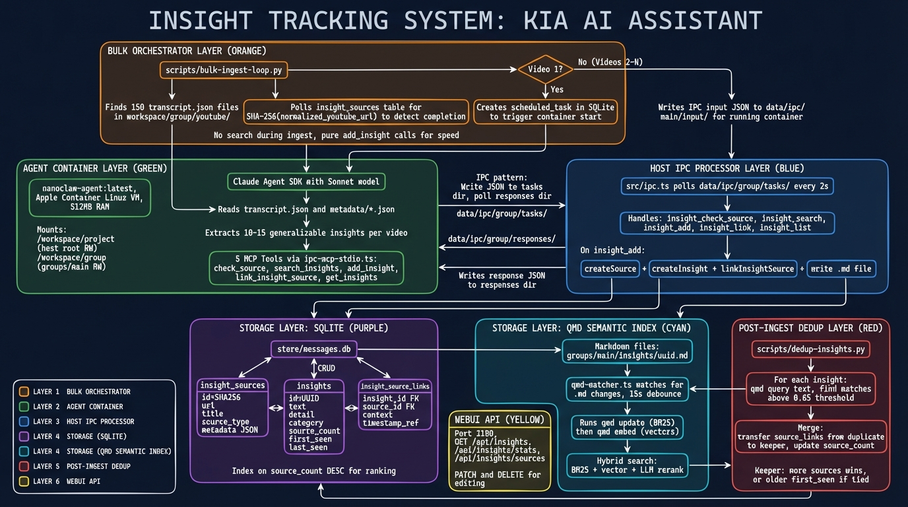

# Insight Tracking System


Collect, deduplicate, and rank insights extracted from content sources. The agent extracts generalizable principles from articles, YouTube videos, PDFs, and podcasts. When the same principle appears across multiple independent sources, it rises to the top — surfacing the most robust, widely-observed ideas.

## How It Works

The system has two key operations:

1. **Ingest** — Given content (URL, transcript, document), extract 5-20 standalone insights and store them with source attribution.
2. **Deduplicate** — Before storing each insight, search for semantically similar ones already in the database. If found, link the new source to the existing insight instead of creating a duplicate.

The result: insights corroborated by many sources rank highest.

## Architecture

```
Container (Agent)                              Host (Node.js)
──────────────────────────────────────────────────────────────
1. Fetch content (firecrawl / youtube / file)
2. check_source(url)           ──IPC──>   SQLite: source exists?
3. Extract insights (LLM)
4. For each insight:
   a. search_insights(text)    ──IPC──>   qmd hybrid search
   b. Agent judges if match
   c. add_insight() or         ──IPC──>   SQLite + write .md
      link_insight_source()    ──IPC──>   SQLite (bump count)
5. refresh_memory_index()      ──IPC──>   qmd update + embed
──────────────────────────────────────────────────────────────
WebUI: /api/insights/* ──> SQLite queries ──> Insights dashboard
```

### Overview


### Detailed Architecture



### Two Storage Layers

| Layer | Location | Purpose |
|-------|----------|---------|
| **SQLite** | `store/messages.db` | Structured data: insights, sources, links, counts, timestamps |
| **qmd** | `groups/{folder}/insights/*.md` | Semantic search: each insight written as markdown so qmd can index it for BM25 + vector hybrid search |

SQLite is the source of truth. qmd provides the semantic search layer that enables deduplication across differently-worded expressions of the same idea.

## Database Schema

Three tables in `src/db.ts`:

### `insight_sources`

One row per unique content source, keyed by SHA-256 hash of the normalized URL.

| Column | Type | Description |
|--------|------|-------------|
| `id` | TEXT PK | SHA-256 of canonical URL |
| `url` | TEXT | Original URL or file path |
| `title` | TEXT | Source title |
| `source_type` | TEXT | `article`, `youtube`, `pdf`, `podcast`, `other` |
| `metadata` | TEXT | JSON: `{ author_name, channel, video_id, published, viewCount }` |
| `indexed_at` | TEXT | ISO timestamp |

URL normalization (`hashSourceUrl()`): strips tracking parameters and fragments, normalizes YouTube URLs to canonical `youtube.com/watch?v={ID}` form, then SHA-256 hashes the result. This means the same video linked as `youtu.be/abc`, `youtube.com/watch?v=abc&feature=share`, or `youtube.com/watch?v=abc` all resolve to the same source ID.

### `insights`

One row per unique abstract principle.

| Column | Type | Description |
|--------|------|-------------|
| `id` | TEXT PK | UUID |
| `text` | TEXT | Bold thesis: short, generalizable (10-20 words) |
| `detail` | TEXT | 2-3 sentences expanding with specific context |
| `category` | TEXT | `strategy`, `technical`, `trend`, `principle`, `tactic`, etc. |
| `source_count` | INTEGER | Denormalized count of linked sources (drives sort order) |
| `first_seen` | TEXT | ISO timestamp of first source |
| `last_seen` | TEXT | ISO timestamp of most recent source |
| `group_folder` | TEXT | Which group owns this insight |

The `text` field is the dedup key. It must be abstract enough that two different videos expressing the same idea would produce nearly identical text. Example:

- **Good**: "AI commoditizes execution, making taste and curation the new scarce skills"
- **Bad**: "Greg Isenberg's guest says you need taste to stand out from AI"

The `detail` field holds video-specific context. The `text` is the headline; `detail` is the paragraph.

### `insight_source_links`

Many-to-many join table connecting insights to sources.

| Column | Type | Description |
|--------|------|-------------|
| `insight_id` | TEXT FK | References `insights(id)` ON DELETE CASCADE |
| `source_id` | TEXT FK | References `insight_sources(id)` ON DELETE CASCADE |
| `context` | TEXT | Direct quote from the source supporting this insight |
| `timestamp_ref` | TEXT | Video timestamp like `12:34` or `1:01:01` |
| `linked_at` | TEXT | ISO timestamp |

Each link carries its own `context` and `timestamp_ref`, so the same abstract insight can have different supporting quotes and timestamps from each source.

## IPC Protocol

The container agent communicates with the host via JSON files. This is the same IPC mechanism used by all BastionClaw tools.

### Request Flow

1. Container writes `data/ipc/{group}/tasks/{timestamp}-{type}.json`
2. Host watcher picks it up, processes it, **deletes** the task file
3. Host writes response to `data/ipc/{group}/responses/{requestId}.json`
4. Container polls for the response file, reads it, **deletes** it

Files are ephemeral — nothing accumulates.

### IPC Cases

| IPC Type | Action | Response |
|----------|--------|----------|
| `insight_check_source` | `getSourceByHash(urlHash)` | `{ exists, source? }` |
| `insight_search` | qmd hybrid search, fallback to SQL LIKE | `{ results: [{ id, text, source_count, score }] }` |
| `insight_add` | Create source + insight + link, write `.md` | `{ insight_id, source_id, is_new: true }` |
| `insight_link` | Create source if needed, link to existing, bump count | `{ insight_id, source_id, new_source_count }` |
| `insight_list` | `getTopInsights()` with sort/filter/pagination | `{ insights, total }` |
| `refresh_index` | `qmd update` + `qmd embed -c {folder}` synchronously | `{ ok: true }` |

### Semantic Search Pipeline (`insight_search`)

The search uses a two-tier approach:

1. **qmd hybrid search** (primary) — Runs `qmd query --json {query}` which combines BM25 keyword matching with semantic vector similarity. Searches over `groups/{group}/insights/*.md` files. Parses the returned `docid` to extract insight UUIDs.

2. **SQL keyword fallback** — If qmd is unavailable or returns insufficient results, falls back to `searchInsightsKeyword()` which uses SQL `LIKE %query%` on the `text` column, sorted by `source_count`.

Results are deduplicated and capped at the requested limit.

### The `refresh_memory_index` Bottleneck

This tool is **blocking** — it calls `qmd update` then `qmd embed` via `execFileSync` and writes an IPC response only when complete. The container polls and waits (up to 60 seconds).

This is critical for bulk ingestion: after adding insights for video N, the index must be refreshed before processing video N+1 so that `search_insights` can find video N's insights when deduplicating video N+1.

## MCP Tools

Five tools exposed to the agent via the MCP stdio server (`container/agent-runner/src/ipc-mcp-stdio.ts`):

### `check_source`
```
Input:  { url: string }
Output: { exists: boolean, source?: { id, title, indexed_at } }
```
Fast O(1) lookup by URL hash. Gate before fetching content.

### `search_insights`
```
Input:  { query: string, limit?: number }
Output: { results: [{ id, text, source_count, category, score }] }
```
Hybrid semantic + keyword search. The agent uses the results to judge whether a new insight matches an existing one.

### `add_insight`
```
Input:  { text, detail?, source_url, source_title?, source_type,
          source_metadata?, category?, context?, timestamp_ref? }
Output: { insight_id, source_id, is_new: true }
```
Creates source (if new) + insight + link. Also writes `groups/{group}/insights/{id}.md` for qmd indexing.

### `link_insight_source`
```
Input:  { insight_id, source_url, source_title?, source_type,
          source_metadata?, context?, timestamp_ref? }
Output: { insight_id, source_id, new_source_count }
```
Corroboration path: links a new source to an existing insight and bumps `source_count`.

### `get_insights`
```
Input:  { sort_by?: 'source_count' | 'recent', limit?, offset?, category? }
Output: { insights: [...], total }
```
Read-only listing with sort/filter/pagination.

### `refresh_memory_index`
```
Input:  (none)
Output: { ok: boolean, error?: string }
```
Blocks until qmd finishes re-indexing. 60-second timeout.

## qmd Integration

### Auto-Indexing (`src/qmd-watcher.ts`)

On startup, `startQmdWatcher()`:
1. Registers each subdirectory of `groups/` as a qmd collection
2. Runs initial `qmd update` + `qmd embed`
3. Starts a recursive file watcher on `groups/` for `.md` changes

The watcher uses a two-timer debounce:
- **15-second debounce**: resets on each change (waits for burst to settle)
- **60-second max delay**: forces indexing even during continuous writes

When triggered, runs `qmd update` (discover new/changed files) then `qmd embed` (generate vectors).

### Insight Markdown Files

When `insight_add` fires, it writes:

```markdown
# AI commoditizes execution, making taste the new scarce skill

In the age of AI-generated content, the ability to curate and apply
taste becomes the primary differentiator for creators and builders.

Category: strategy
Source: https://www.youtube.com/watch?v=abc123
```

File path: `groups/{group}/insights/{uuid}.md`

This file is what qmd indexes. The `search_insights` IPC handler queries qmd, which returns matches ranked by hybrid BM25 + semantic similarity, enabling dedup even when two insights use different wording for the same idea.

### PreCompact Conversation Archiving

The container agent has a `PreCompact` hook that fires before the SDK compacts context. It:

1. Reads the raw JSONL transcript
2. Parses user/assistant messages
3. Formats as markdown
4. Writes to `groups/{group}/conversations/{date}-{slug}.md`

Since this directory is under `groups/`, qmd indexes it automatically. The agent loses raw context to compaction but gains it back as searchable memory via `memory_hybrid_search`.

## WebUI

### REST API (`src/webui/api/insights.ts`)

| Method | Endpoint | Purpose |
|--------|----------|---------|
| GET | `/api/insights` | List insights (sort, filter, search, paginate) |
| GET | `/api/insights/stats` | Summary: total insights, sources, top insight, categories |
| GET | `/api/insights/sources` | All indexed sources with insight counts |
| GET | `/api/insights/sources/:id` | Single source with linked insights |
| GET | `/api/insights/:id` | Single insight with all linked sources |
| DELETE | `/api/insights/:id` | Delete insight (cascades links) |
| PATCH | `/api/insights/:id` | Update text/category |

Static routes (`/stats`, `/sources`) are registered before the parameterized `/:id` route to avoid Fastify matching "stats" as an insight ID.

### Frontend (`ui/src/ui/views/insights.ts`)

The Insights tab (under Operations in navigation) has three sections:

**Stats cards** — Total insights, total sources, top insight with source count.

**Insights list** — Each insight shows:
- Bold thesis text (font-weight 700)
- Detail paragraph below
- Category chip and source count chip
- Expandable `<details>` for sources (lazy-loaded on first open)
- Per source: title with author name, context quote in italics, source type chip, timestamp chip
- YouTube timestamps render as clickable deep-links (`youtube.com/watch?v={id}&t={seconds}`)
- Delete button with two-click confirmation (3-second timeout)

**Sources table** — All indexed sources with title, URL, type, insight count, and time since indexing.

## Skills

### `/ingest` — Single Source Ingestion

Interactive skill for ingesting one URL, file, or transcript at a time.

1. Identify source type (article/youtube/pdf/podcast)
2. `check_source(url)` — skip if already indexed
3. Fetch content via appropriate tool
4. Extract 5-20 insights with short thesis + detail + category + context quote + timestamp
5. For each: `search_insights(text)` → agent judges similarity → `add_insight()` or `link_insight_source()`
6. `refresh_memory_index()` to update the search index
7. Report summary

### `/youtube-bulk-ingest` — Batch YouTube Processing

Processes all local YouTube transcripts at `workspace/group/youtube/{date}/{channel}/{slug}/`.

Key constraints:
- **Serial processing** — one video at a time (parallel breaks cross-video dedup)
- **Refresh after each video** — `refresh_memory_index()` blocks until complete before starting the next video
- **Skip already indexed** — `check_source(url)` gates each video, making re-runs safe
- **Progress updates** — sends Telegram message every 5 videos

The serial + refresh pattern is the mechanism that enables dedup within a batch. Without it, insights from video N wouldn't be in the search index when deduplicating video N+1.

## Files

| File | Purpose |
|------|---------|
| `src/db.ts` | Schema (3 tables), migrations, ~15 CRUD functions, `hashSourceUrl()` |
| `src/ipc.ts` | 5 IPC handler cases for insight operations + `refresh_index` |
| `container/agent-runner/src/ipc-mcp-stdio.ts` | 5 MCP tools + `refresh_memory_index` |
| `src/qmd-watcher.ts` | Auto-indexing: file watcher + debounced qmd update/embed |
| `src/webui/api/insights.ts` | REST API (7 endpoints) |
| `src/webui/server.ts` | Route registration |
| `ui/src/ui/views/insights.ts` | Frontend view (Lit HTML) |
| `ui/src/ui/navigation.ts` | Nav tab entry |
| `ui/src/ui/app.ts` | State properties + loaders |
| `ui/src/ui/app-render.ts` | Render dispatch |
| `ui/src/ui/types.ts` | TypeScript interfaces |
| `ui/src/ui/icons.ts` | Lightbulb icon |
| `.claude/skills/ingest/SKILL.md` | Single-source ingestion skill |
| `.claude/skills/youtube-bulk-ingest/SKILL.md` | Batch YouTube ingestion skill |
| `.claude/commands/insights.md` | Quick read-only viewer command |

## Data Flow

```
Content Source (URL / transcript / file)
        │
        ▼
┌─ check_source(url) ─────────────────┐
│  SHA-256(normalize(url)) → SQLite    │
│  exists? → skip or re-process        │
└──────────────────────────────────────┘
        │ (new source)
        ▼
┌─ Fetch Content ──────────────────────┐
│  article → firecrawl                 │
│  youtube → youtube-full / local      │
│  pdf → file read                     │
│  podcast → user provides transcript  │
└──────────────────────────────────────┘
        │
        ▼
┌─ Extract Insights (LLM) ────────────┐
│  5-20 per source                     │
│  text: abstract thesis (10-20 words) │
│  detail: 2-3 sentences context       │
│  category, context quote, timestamp  │
└──────────────────────────────────────┘
        │
        ▼ (for each insight)
┌─ search_insights(text) ─────────────┐
│  1. qmd hybrid (BM25 + semantic)    │
│  2. fallback: SQL LIKE              │
│  → agent judges if match exists     │
└──────────────┬───────────────┬──────┘
               │               │
          no match         match found
               │               │
               ▼               ▼
        add_insight()   link_insight_source()
        (new insight)   (bump source_count)
        (write .md)
               │               │
               └───────┬───────┘
                       ▼
             refresh_memory_index()
             (qmd update + embed)
                       │
                       ▼
              Next insight / video
```

## Design Decisions

**Why two storage layers?** SQLite alone can't do semantic similarity matching — you'd only get exact string matches. qmd provides vector embeddings that can match "AI makes execution cheap" with "automation commoditizes production" even though they share no keywords.

**Why write markdown files?** qmd indexes files on disk. By writing each insight as a `.md` file under `groups/{group}/insights/`, we piggyback on the existing qmd collection system and file watcher. No custom integration needed.

**Why serial bulk processing?** Parallel ingestion means video N+1 starts before video N's insights are indexed. The `search_insights` call can't find insights from video N, so identical insights get created as duplicates. Serial + refresh-after-each guarantees the search index is always current.

**Why blocking `refresh_memory_index`?** The previous fire-and-forget approach meant the agent couldn't know when indexing was done. It would move to the next video before the index was ready, breaking dedup. The blocking (request-response) pattern ensures the agent waits for qmd to finish before proceeding.

**Why abstract thesis text?** If insights are too specific ("Greg Isenberg says taste matters"), they'll never match across sources. The abstract thesis ("AI commoditizes execution, making taste the new scarce skill") is the dedup key — it must be general enough that the same idea from a different speaker would produce nearly identical text. Source-specific details go in `detail` and `context`.

**Why `source_count` is denormalized?** Could be computed as `COUNT(*)` from `insight_source_links`, but sorting 1000+ insights by a joined count on every page load is expensive. The denormalized column with an index makes the common "top insights" query O(log n).

## Bulk Ingest Pipeline (`scripts/bulk-ingest-loop.py`)

External Python script that drives bulk YouTube transcript ingestion without running inside the container. Processes all unindexed videos from the local `workspace/group/youtube/` directory.

### How It Works

The script uses two mechanisms to feed work to the container agent:

1. **Scheduled task bootstrap** — First video (and after each container recycle) inserts a `schedule_type='once'` task into `scheduled_tasks`. The host's task scheduler picks it up and spawns a container.
2. **IPC message injection** — Subsequent videos write JSON files to `data/ipc/main/input/`. The running container's `pollIpcDuringQuery()` reads these as new user messages, triggering fresh queries.

```
Python Script                    Host (Node.js)               Container (Agent)
─────────────────────────────────────────────────────────────────────────────────
INSERT scheduled_task ──────>  Scheduler picks up task ──>  Container spawns
                               Container runs query         Agent processes video 1
                                                            Writes insights via IPC
Wait for source in DB  <─────  IPC responses flow back  <── add_insight() calls
Wait for insight count stable
Write IPC input file   ──────>  (passthrough)           ──>  pollIpcDuringQuery()
                                                            Agent processes video 2
...repeat...
Kill container (recycle) ────>  Host detects exit
Clear sessions + DB ID
INSERT new scheduled_task ───>  Scheduler spawns fresh container
```

### Key Design Constraints

**IPC messages are consumed by the active query.** The container's `pollIpcDuringQuery()` drains IPC input files and pipes them into the currently-running query's `MessageStream`. This means you must wait for the current video to finish before sending the next one — otherwise the next video's prompt gets folded into the current query as a follow-up message rather than starting a new query.

**Session context accumulates across videos.** The container resumes its latest session via `resumeAt: latest`. After ~9 videos, the accumulated context exceeds the prompt limit. The script must periodically recycle the container and clear session state.

**Container memory grows per query round.** The `allMessages` array in the agent-runner accumulated all messages across IPC-injected query rounds. Fixed by clearing `allMessages.length = 0` after each `exportConversationSnapshot`. Without this fix, the container OOM-kills at ~15 videos (512 MB limit).

**SQLite WAL reads can be stale.** A long-lived SQLite connection may not see writes from the host process due to WAL checkpointing. The script opens a fresh `sqlite3.connect()` for each check via `fresh_db()`.

### Container Lifecycle

The script recycles the container every 8 videos to prevent session bloat:

```python
RECYCLE_EVERY = 8

if container_started and videos_in_session >= RECYCLE_EVERY:
    kill_container()     # container stop + clear sessions + clear DB session ID
    cleanup_ipc_input()  # remove stale IPC files
    cleanup_ingest_tasks(db)  # remove old scheduled tasks
    time.sleep(5)        # let host detect exit
    container_started = False
```

On each recycle or timeout recovery, `clear_sessions()`:
1. Removes all JSONL files from `data/sessions/main/.claude/projects/-workspace-group/`
2. Deletes the session ID from the `sessions` table so the host doesn't pass the old ID to the next container

### Timeout Recovery

If a video doesn't appear in `insight_sources` within 600 seconds:

1. Kill the container (`container stop` with 15s timeout)
2. Clear IPC input files and stale scheduled tasks
3. Clear sessions (files + DB)
4. Wait 5 seconds for host to detect exit
5. Mark `container_started = False` — next video will bootstrap via scheduled task

### URL Normalization

Both the host (`hashSourceUrl()` in `src/db.ts`) and the Python script (`normalize_youtube_url()`) must normalize YouTube URLs identically. The regex handles:
- `youtube.com/watch?v=ID`
- `youtube.com/shorts/ID`
- `youtube.com/embed/ID`
- `youtu.be/ID`

All normalize to `https://www.youtube.com/watch?v=ID` before SHA-256 hashing. A mismatch between host and script causes false "not indexed" results, leading to duplicate processing or infinite waits.

### Shorts Filtering

Videos shorter than 120 seconds (YouTube Shorts) are skipped during `find_all_videos()` by checking the last segment's `start` field in `transcript.json`. Existing shorts sources and their orphaned insights are cleaned up separately.

### Dedup

The bulk ingest script does **not** deduplicate during ingestion — each video's insights are added as new (`add_insight` only, no `search_insights` or `link_insight_source`). Deduplication happens in a separate post-ingest pass via `scripts/dedup-insights.py`, which uses qmd semantic search to find and merge similar insights across all sources.

This separation exists because in-container dedup requires `refresh_memory_index` after each video (slow, blocking) and the agent must judge similarity (uses LLM tokens). Batch dedup after ingestion is faster and more cost-effective.

### WebUI Pagination

The insights dashboard paginates both insights and sources at 20 items per page. The API already supported `limit` and `offset` parameters; the frontend passes `page * pageSize` as the offset. Page resets to 0 when filters (category, sort, search) change.

### Files

| File | Purpose |
|------|---------|
| `scripts/bulk-ingest-loop.py` | Main orchestration script |
| `scripts/dedup-insights.py` | Post-ingest semantic deduplication |
| `container/agent-runner/src/index.ts` | Query loop with `allMessages` memory fix |
| `src/db.ts` | `hashSourceUrl()` with `/shorts/` normalization |
| `src/task-scheduler.ts` | Picks up `schedule_type='once'` ingest tasks |
| `src/group-queue.ts` | Container lifecycle, `_close` sentinel handling |

### Operational Notes

- **~2 min per video** at steady state (container spawn ~45s, IPC round-trip ~4-6s per insight, ~10-15 insights per video)
- **Container memory** stays under 400 MB with the `allMessages` fix, recycling every 8 videos
- **Always use `./scripts/restart.sh`** — raw service restarts don't clean up orphaned containers or stale IPC files
- **Re-running is safe** — `is_indexed()` skips already-processed videos via URL hash lookup
- **Monitor with**: `sqlite3 store/messages.db "SELECT COUNT(*) FROM insight_sources; SELECT COUNT(*) FROM insights;"` and `container stats --no-stream`
