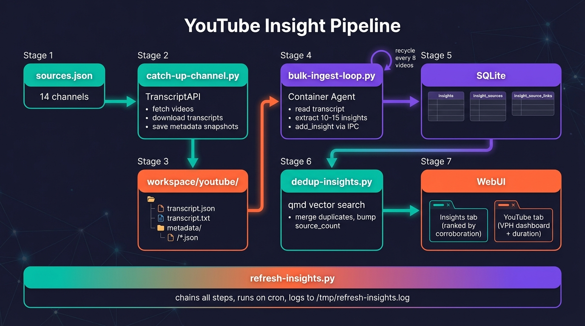

# YouTube Insight Pipeline

Automated system that monitors YouTube channels, fetches transcripts, extracts actionable insights, deduplicates them, and surfaces everything through the BastionClaw WebUI.

## Purpose

Track what thought leaders and creators are saying across YouTube. Instead of watching hundreds of videos manually, the pipeline:

1. Pulls the latest videos from tracked channels
2. Fetches full transcripts via TranscriptAPI
3. Extracts generalizable insights (principles, strategies, trends) using an AI agent in a container
4. Deduplicates insights semantically — when multiple creators say the same thing, it merges them and bumps the source count
5. Ranks insights by corroboration (how many independent sources said the same thing)
6. Generates a sortable VPH dashboard showing which videos are gaining traction

The result: a ranked knowledge base of ideas validated across multiple sources, plus a real-time view of what content is trending.

## Architecture



Seven stages, orchestrated by `refresh-insights.py`:

1. **sources.json** — channel handles to track
2. **catch-up-channel.py** — fetch videos + transcripts via TranscriptAPI, save metadata snapshots
3. **workspace/youtube/** — transcripts, plain text, timestamped metadata files on disk
4. **bulk-ingest-loop.py** — feed transcripts to container agent, extract 10-15 insights per video via IPC
5. **SQLite** — `insights`, `insight_sources`, `insight_source_links` tables
6. **dedup-insights.py** — semantic dedup via qmd vector search, merge duplicates, bump source_count
7. **WebUI** — Insights tab (ranked by corroboration) + YouTube tab (VPH dashboard with duration)

## Components

### Sources (`sources.json`)

Location: `.claude/skills/youtube-planner/sources.json`

```json
{
  "sources": [
    "@ColeMedin",
    "@GregIsenberg",
    "@rasmic"
  ],
  "lookback_days": 30
}
```

- `sources` — YouTube channel handles to track
- `lookback_days` — how many days of videos to fetch (default 30)

Managed via the WebUI YouTube tab (add/remove channels) or the `/refresh-insights` slash command.

### Video Fetcher (`catch-up-channel.py`)

Location: `.claude/skills/youtube-planner/catch-up-channel.py`

For each channel:
- Fetches the latest 15 videos via TranscriptAPI's channel endpoint
- Filters to videos within the lookback window
- Fetches full transcripts (cached — never re-fetched)
- Saves timestamped metadata snapshots (never cached — always new file)

Metadata snapshots enable VPH (views per hour) tracking and sparkline trend charts. Each snapshot also includes `duration_seconds` (computed from the last transcript segment's `start + duration`) when a transcript is available.

### Insight Extraction (`bulk-ingest-loop.py`)

Location: `scripts/bulk-ingest-loop.py`

Feeds transcripts to the BastionClaw container agent one at a time:
- First video starts a container via scheduled task
- Subsequent videos inject via IPC messages to the running container
- The agent reads each transcript and calls `add_insight` for 10-15 insights per video
- Skips already-indexed videos (checks `insight_sources` table)
- Recycles the container every 8 videos to prevent session bloat

Each insight has:
- **text** — A generalizable principle (not video-specific)
- **detail** — 2-3 sentences of supporting context
- **category** — strategy, technical, creativity, productivity, business, psychology, trend, career
- **context** — Direct quote from the transcript
- **timestamp_ref** — MM:SS reference into the video

### Deduplication (`dedup-insights.py`)

Location: `scripts/dedup-insights.py`

After bulk ingestion, runs semantic dedup:
- For each insight, queries the qmd vector index for similar insights
- When a match exceeds the similarity threshold (default 0.65):
  - Keeps the insight with more sources (or older if tied)
  - Transfers all source links from the duplicate to the keeper
  - Updates the keeper's source count
  - Deletes the duplicate
- Tracks which insights have been checked (`dedup_checked_at` column) so subsequent runs only process new insights

This is what makes multi-source insights valuable — when 5 different creators independently say the same thing, it surfaces as a high-confidence signal.

### Dashboard Generator (`generate-dashboard.py`)

Location: `.claude/skills/youtube-planner/generate-dashboard.py`

Produces a standalone `dashboard.html` with:
- Sortable table (Thumbnail, Title, Channel, Published, Views, VPH, Trend)
- VPH = views / hours since publish (highlights fast-growing videos)
- Inline SVG sparklines showing view trajectory over time
- Color-coded trends: green (accelerating), red (decelerating), gray (flat)

### Pipeline Orchestrator (`refresh-insights.py`)

Location: `scripts/refresh-insights.py`

Chains all steps into a single cron-friendly script:

```
Step 1: Validate TRANSCRIPT_API_KEY
Step 2: Read sources.json
Step 3: For each channel → run catch-up-channel.py
Step 4: Run bulk-ingest-loop.py (extract insights from new transcripts)
Step 5: Run dedup-insights.py (merge semantic duplicates)
Step 6: Run generate-dashboard.py (rebuild HTML dashboard)
Step 7: Log summary to /tmp/refresh-insights.log
```

Each step is a subprocess with timeouts. Failures are logged but don't cascade. Exit code 0 on success, non-zero if critical steps fail.

### Slash Command (`/refresh-insights`)

Location: `.claude/commands/refresh-insights.md`

Interactive setup and execution:
1. Validates API keys (`TRANSCRIPT_API_KEY`, `ANTHROPIC_API_KEY`)
2. Source management — add channels via search or manual entry
3. Configure lookback period (7/14/30 days)
4. Set up cron schedule (every 6/8/12 hours)
5. Runs the pipeline immediately

## WebUI Pages

### Insights Tab

Shows all extracted insights ranked by source count (corroboration).

**Stats cards** — Total insights, total sources, top insight

**Pipeline Activity panel** (collapsible) — Source type breakdown, category distribution, recent activity (24h/7d/30d), average sources per insight, pipeline log viewer

**Search and filter** — Full-text search, category filter, sort by source count or recency

**Insight list** — Each insight shows the generalizable thesis, detail paragraph, category chip, source count, and expandable source list with YouTube deep-links (click to jump to the exact timestamp in the video)

### YouTube Tab

Real-time dashboard of tracked video performance.

**Stats overview** — Videos tracked, channels, top VPH

**Channel management** (collapsible) — View/add/remove tracked channels

**Video table** — Sortable by title, channel, published date, duration, views, or VPH. Each row shows thumbnail, title (linked), channel, publish date with local time, duration (Xm Ys), view count, VPH, and inline SVG sparkline with trend direction.

## File Layout

```
bastionclaw/
  .claude/
    skills/youtube-planner/
      sources.json              Tracked channels + config
      SKILL.md                  Skill definition
      catch-up-channel.py       Fetch videos + transcripts per channel
      generate-dashboard.py     Build standalone HTML dashboard
    commands/
      refresh-insights.md       /refresh-insights slash command
  scripts/
    refresh-insights.py         Pipeline orchestrator (cron entry point)
    bulk-ingest-loop.py         Feed transcripts to container agent
    dedup-insights.py           Semantic deduplication pass
  src/
    db.ts                       getInsightActivity() + all insight DB functions
    webui/
      api/insights.ts           /api/insights/activity endpoint
      api/youtube.ts            /api/youtube/dashboard, /sources endpoints
      server.ts                 Route registration
  ui/src/ui/
    views/insights.ts           Insights page with activity panel
    views/youtube.ts            YouTube dashboard page
    navigation.ts               YouTube tab in Operations group
    types.ts                    InsightActivityData, YouTubeVideoData types
    icons.ts                    YouTube play icon
    app.ts                      State + loaders for YouTube + insight activity
    app-render.ts               YouTube view rendering
  workspace/group/youtube/
    dashboard.html              Generated standalone dashboard
    {date}/{channel}/{video}/
      transcript.json           Raw transcript
      transcript.txt            Plain text transcript
      metadata/{timestamp}.json View count snapshots
  store/messages.db
    insights                    Extracted insights
    insight_sources             Indexed source URLs
    insight_source_links        Join table (context + timestamps)
```

## Running the Pipeline

### Manual (one-time)

```bash
# Fetch videos for all tracked channels
for channel in $(python3 -c "import json; print(' '.join(json.load(open('.claude/skills/youtube-planner/sources.json'))['sources']))"); do
  python3 .claude/skills/youtube-planner/catch-up-channel.py "$channel"
done

# Extract insights from new transcripts
python3 scripts/bulk-ingest-loop.py

# Deduplicate
python3 scripts/dedup-insights.py

# Regenerate dashboard
python3 .claude/skills/youtube-planner/generate-dashboard.py
```

### Automated (via orchestrator)

```bash
# Run full pipeline
TRANSCRIPT_API_KEY=... python3 scripts/refresh-insights.py

# Or set up cron (the /refresh-insights command does this interactively)
# Example: every 8 hours
0 */8 * * * TRANSCRIPT_API_KEY=... ANTHROPIC_API_KEY=... python3 /path/to/bastionclaw/scripts/refresh-insights.py >> /tmp/refresh-insights.log 2>&1
```

### Via slash command

```
/refresh-insights
```

Walks through source setup, lookback config, cron scheduling, and runs immediately.

## API Keys Required

| Key | Purpose |
|-----|---------|
| `TRANSCRIPT_API_KEY` | TranscriptAPI — fetches YouTube transcripts and channel video lists |
| `ANTHROPIC_API_KEY` | Container agent — extracts insights from transcripts (should already be configured if BastionClaw is running) |
